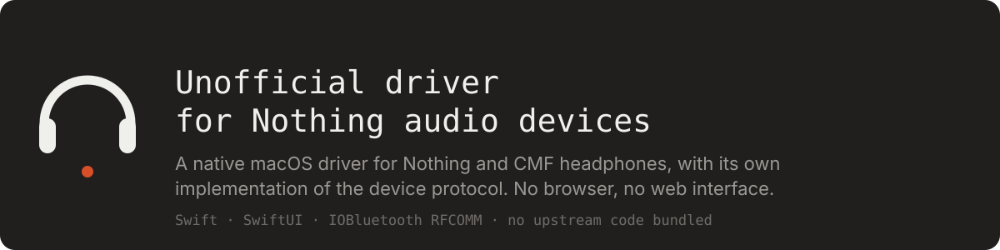

<p align="center">
  
</p>

<p align="right">🇬🇧 English · 🇷🇺 <a href="Documentation/README.ru.md">Читать по-русски</a></p>

<p align="center">
  <a href="https://www.apple.com/macos/"></a>
  <a href="https://swift.org"></a>
  <a href="https://github.com/radiance-project/ear-web"></a>
  
  <a href="https://github.com/Letsrollamigo/nothing-audio-driver-macos/actions/workflows/build.yml"></a>
  <a href="LICENSE"></a>
</p>

**Unofficial driver for Nothing audio devices** is a native macOS application for controlling Nothing and CMF headphones — noise cancellation, equaliser, gestures, battery, firmware info — without a browser.

It exists because of one hard fact: the excellent [ear (web)](https://github.com/radiance-project/ear-web) driver talks to headphones through the **Web Serial API over Bluetooth SPP**, and WebKit implements no such thing. Safari cannot run it. Neither can any WKWebView. So this app takes the interface as-is and hands it a transport of its own — a native `IOBluetooth` RFCOMM bridge behind a `navigator.serial` shim.

The result: the same interface, in a real application window, with no Chromium, no Docker, no local web server.

## Credit where it is due

Everything that knows anything about headphones is upstream. The wire protocol, the per-model configuration, the firmware gating, all 19 device screens — that is the work of the [ear (web)](https://github.com/radiance-project/ear-web) authors, published under AGPL-3.0 and deployed at [earweb.bttl.xyz](https://earweb.bttl.xyz).

This repository adds three files' worth of plumbing and **bundles none of their code**. On first launch the app fetches the interface from their own deployment, onto your machine, and keeps a local copy so it works offline afterwards.

> **Reporting bugs:** if a device control does nothing, a model is not recognised, or an equaliser band is wrong — that is upstream: [radiance-project/ear-web/issues](https://github.com/radiance-project/ear-web/issues). Issues *here* should be about the macOS side: the Bluetooth bridge, the window, signing, permissions, the updater.

## What you get

**A real application** — icon in the Dock, its own window, launched like anything else. No tab, no localhost, no container.

**A native Bluetooth transport** — the app finds the device's custom SPP service over SDP, opens the RFCOMM channel, and reassembles the protocol frames itself. When the headphones drop an idle channel, it reconnects silently and replays what you pressed.

**Offline operation** — the interface lives on your disk after the first fetch. No network is needed to change a listening mode.

**Quiet updates** — on launch the app compares its copy against the live site by `Last-Modified` and size, downloads a fresh one when it differs, and keeps exactly one copy on disk.

## What it is not

It is not a fork, not a mirror, and not a redistribution of ear (web). It adds no device support of its own: if upstream does not support your model, neither does this. It is unsigned by Apple — you build it yourself and sign it with your own certificate.

## Getting it

| Channel | What you get | Trade-off |
|---|---|---|
| **[Releases](https://github.com/Letsrollamigo/nothing-audio-driver-macos/releases/latest)** | A ready `.app`, built by CI from tagged source | Ad-hoc signed, so macOS asks for Bluetooth permission again after every update, and the bundle needs `xattr -d com.apple.quarantine` once |
| **Building from source** | The same app signed with your own certificate | Two minutes of setup — and the Bluetooth permission then survives every rebuild |

Building it yourself is the better experience, and it is genuinely two commands. The release exists for people who just want to try it.

## Requirements

- macOS 13 or later, Apple Silicon or Intel
- Xcode command line tools (`swiftc`, `codesign`, `iconutil`)
- Headphones already paired in System Settings → Bluetooth
- A Nothing or CMF device supported by upstream

## Building from source

```bash
git clone https://github.com/Letsrollamigo/nothing-audio-driver-macos.git
cd nothing-audio-driver-macos
./build.sh
open "build/Unofficial driver for Nothing audio devices.app"
```

That is the whole build. No package manager, no Xcode project, no dependencies — `build.sh` compiles two Swift files, assembles the bundle and signs it.

| Command | What it does |
|---|---|
| `./build.sh` | Build into `build/` |
| `./build.sh --test` | Run the path-normalisation check |
| `./build.sh --install` | Build and copy into `/Applications` |
| `SITE_SRC=/path/to/site ./build.sh` | Bundle an interface copy you already have |
| `SITE_SRC=none ./build.sh` | Build without one (default when nothing is found) |

### Signing, and why it matters

macOS gates Bluetooth behind TCC, and TCC identifies an application by its code signature. With the default ad-hoc signature the hash changes on every build, so **the system asks for Bluetooth permission again after every rebuild**. A self-signed certificate fixes that permanently:

1. Keychain Access → Certificate Assistant → Create a Certificate
2. Name `ear-local-dev`, identity type **Self Signed Root**, certificate type **Code Signing** — the default type is S/MIME and will not work
3. Build with it:

```bash
CODESIGN_ID=ear-local-dev ./build.sh --install
```

Grant Bluetooth once on first launch; the permission then survives rebuilds, renames and moving the app to `/Applications`.

## How it's built

| Part | File | Job |
|---|---|---|
| Shell | `Sources/main.swift` | Window, `WKWebView`, serving the interface over a private `earlocal://` scheme |
| Bridge | `Sources/main.swift` (`SerialBridge`) | SDP lookup, RFCOMM channel, frame reassembly, reconnect, outbox |
| Shim | `Sources/shim.js` | Nine members of the Web Serial API on top of `webkit.messageHandlers` |
| Updater | `Sources/SiteUpdater.swift` | Update check, mirroring, pruning old copies |

The interface itself is never modified — the upstream JavaScript keeps calling `navigator.serial.requestPort()` and never learns that the port underneath is not a port at all.

Architecture and protocol notes: [Documentation/ARCHITECTURE.md](Documentation/ARCHITECTURE.md).

## Known constraints

**First run needs freshly connected headphones.** The identification channel that reports the device model is one-shot — the device offers it only right after connecting. The app caches the answer and reuses it forever after, but the very first launch on a given device must catch it live.

**Only what upstream supports.** New models arrive when they arrive upstream; this repository adds none.

**Releases are not notarised.** There is no Apple Developer account behind this project, so a downloaded build needs `xattr -d com.apple.quarantine` once, and its ad-hoc signature makes macOS re-ask for Bluetooth after every update. Building locally with your own certificate avoids both.

## License

[MIT](LICENSE) for everything in this repository. See [NOTICE.md](NOTICE.md) for the relationship to ear (web), which is a separate work under AGPL-3.0.

Nothing and CMF are trademarks of Nothing Technology Limited. This project is unofficial and unaffiliated.
